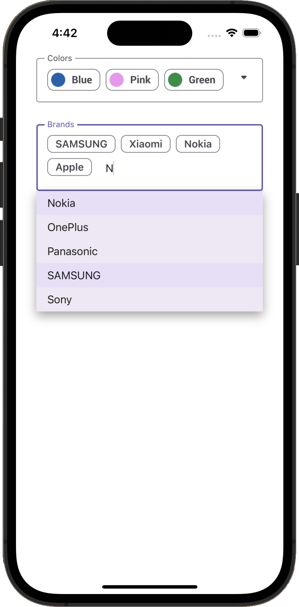

<!-- default badges list -->

<!-- default badges end -->
# DevExpress Editors for .NET MAUI - Token Editors 

This example illustrates how you can incorporate our [TokenEdit](https://docs.devexpress.com/MAUI/DevExpress.Maui.Editors.TokenEdit?v=22.2) and [AutoCompleteTokenEdit](https://docs.devexpress.com/MAUI/DevExpress.Maui.Editors.AutoCompleteTokenEdit?v=22.2) within a [MAUI app](https://learn.microsoft.com/en-us/dotnet/maui/?view=net-maui-7.0) (and configure associated settings).

The Token Edit component allows users to select multiple items from its drop-down list. Selected items appear as chips within the edit box.

The Auto-Complete Token Edit component locates records that match text entered by a user and displays the first item it locates within the data source. It also supports asynchronous item load operations. The editor loads items as users enter text without locking the UI.

## Requirements

Please register the DevExpress NuGet Gallery in Visual Studio to restore NuGet packages used in this solution. See the following topic for more information: [Get Started with DevExpress Mobile UI for .NET MAUI](https://docs.devexpress.com/MAUI/403249/get-started).

You can also refer to the following YouTube video to get started with the DevExpress .NET MAUI Controls: [Setting up a .NET MAUI Project](https://www.youtube.com/watch?v=juJvl5UicIQ).

## Files to Review

* [MauiProgram.cs](./CS/MauiProgram.cs)
* [MainPage.xaml](./CS/MainPage.xaml)
* [MainPage.xaml.cs](./CS/MainPage.xaml.cs)
* [TokenEditViewModel.cs](./CS/TokenEditViewModel.cs)

## Documentation

- [Editors - Get Started](https://docs.devexpress.com/MAUI/403794/editors/get-started?p=netframework)
- [TokenEdit](https://docs.devexpress.com/MAUI/DevExpress.Maui.Editors.TokenEdit?v=22.2)
- [AutoCompleteTokenEdit](https://docs.devexpress.com/MAUI/DevExpress.Maui.Editors.AutoCompleteTokenEdit?v=22.2)

## More Examples

- [DevExpress Mobile UI for .NET MAUI](https://github.com/DevExpress-Examples/maui-demo-app)
- [DevExpress Editors for .NET MAUI](https://github.com/DevExpress-Examples/maui-editors-get-started)
- [DevExpress .NET MAUI Editors - Create Login and Sign-Up Forms](https://github.com/DevExpress-Examples/maui-editors-access-form)
<!-- feedback -->
## Does this example address your development requirements/objectives?

 

(you will be redirected to DevExpress.com to submit your response)
<!-- feedback end -->
