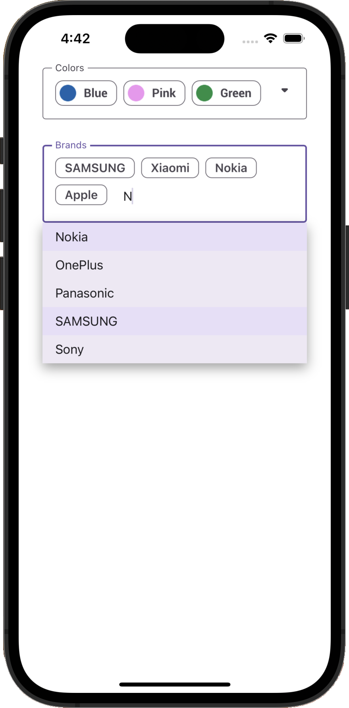

<!-- default badges list -->

<!-- default badges end -->
# DevExpress Editors for .NET MAUI - Token Editors

This example shows how to add the [TokenEdit](https://docs.devexpress.com/MAUI/DevExpress.Maui.Editors.TokenEdit?v=22.2) and [AutoCompleteTokenEdit](https://docs.devexpress.com/MAUI/DevExpress.Maui.Editors.AutoCompleteTokenEdit?v=22.2) components to a [MAUI app](https://learn.microsoft.com/en-us/dotnet/maui/?view=net-maui-7.0) and configure their main settings.

The Token Edit component allows users to select multiple items from the drop-down list. The selected items appear as chips in the edit box.

The Auto-Complete Token Edit component locates records that match the text entered by a user and displays the first item it locates within the data source. It also supports asynchronous item loading. The editor loads items as users enter text without freezing the UI.

## Requirements

Please register the DevExpress NuGet Gallery in Visual Studio to restore the NuGet packages used in this solution. See the following topic for more information: [Get Started with DevExpress Mobile UI for .NET MAUI](https://docs.devexpress.com/MAUI/403249/get-started).

You can also refer to the following YouTube video for more information on how to get started with the DevExpress .NET MAUI Controls: [Setting up a .NET MAUI Project](https://www.youtube.com/watch?v=juJvl5UicIQ).

## Files to Review

* [MauiProgram.cs](./CS/MauiProgram.cs)
* [MainPage.xaml](./CS/MainPage.xaml)
* [MainPage.xaml.cs](./CS/MainPage.xaml.cs)
* [TokenEditViewModel.cs](./CS/TokenEditViewModel.cs)

## Documentation

- [Editors - Get Started](https://docs.devexpress.com/MAUI/403794/editors/get-started?p=netframework)
- [TokenEdit](https://docs.devexpress.com/MAUI/DevExpress.Maui.Editors.TokenEdit?v=22.2)
- [AutoCompleteTokenEdit](https://docs.devexpress.com/MAUI/DevExpress.Maui.Editors.AutoCompleteTokenEdit?v=22.2)

## More Examples

- [DevExpress Mobile UI for .NET MAUI](https://github.com/DevExpress-Examples/maui-demo-app)
- [DevExpress Editors for .NET MAUI](https://github.com/DevExpress-Examples/maui-editors-get-started)
- [DevExpress .NET MAUI Editors - Create Login and Sign-Up Forms](https://github.com/DevExpress-Examples/maui-editors-access-form)
